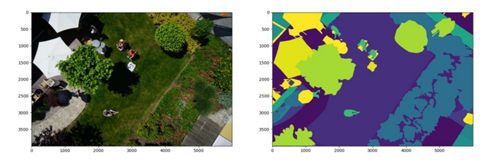
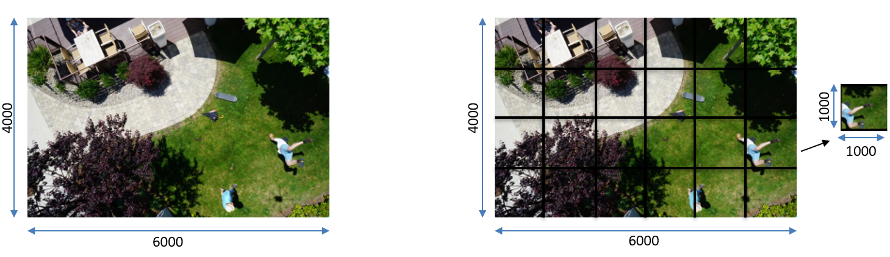
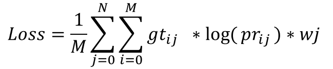
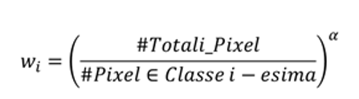
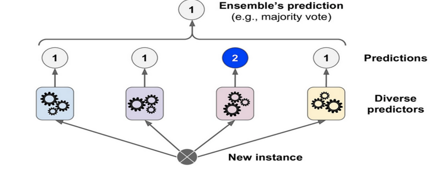
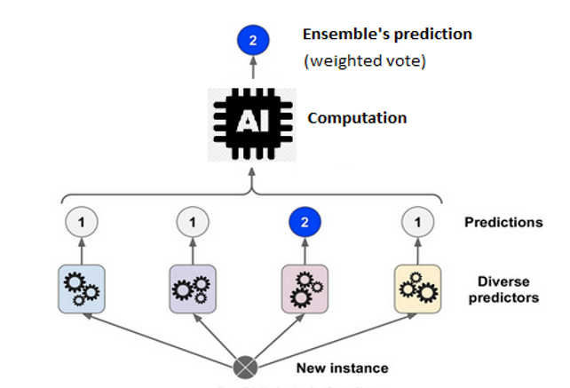
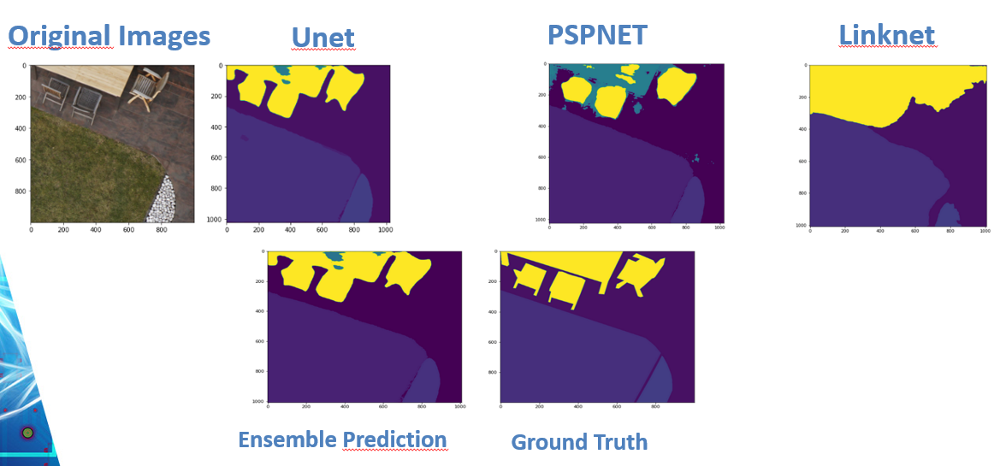

# ICG-Drone-Semantic-Segmentation
Using fully convolutional models for solving a semantic segmentation task on the Aerial Semantic Segmentation drone dataset.
Dataset: https://www.kaggle.com/datasets/bulentsiyah/semantic-drone-dataset

# Goal
The goal is to assign a label, a numerical value, to each pixel of the image in order to identify sets of pixels that belong to a specific category or class.

# Preprocessing
- Each image was cropped into 24 patches.

  
  
# Models and settings used
- PSPNet: https://arxiv.org/abs/1612.01105 
          - Backbone: ResNext50
          - Loss function: Categorical Cross Entropy + Jaccard Loss
          - Optimizer: SGD (Stocastic Gradient Descent)
- Unet: https://arxiv.org/abs/1505.04597
         Backbone: Resnet 152
         Loss function: Weighted categorical cross entropy 
         Optimizer: Adam
         L2 Regulatization: 4e-4
         α: 0.17
- Linknet: https://arxiv.org/pdf/1707.03718.pdf
          Backbone: MobileNet
          Loss function: Categorical Crossentropy + Jaccard Loss
          Optimizer: SGD
          Kernel Regulatization: 10-5
- FPN :https://arxiv.org/abs/1612.03144 
      Backbone: VGG16
      Loss function: Categorical Cross Entropy
      Optimizer: Adam
      Dropout: 0.3
All the backbones are pretrained on ImageNet.
Metrics: Accuracy and mIoU
# Weights Optimization
  Weights are assigned to each class, making the error resulting from incorrect segmentation of minority classes more significant.     
  
  
 
   α: necessary to normalize and modulate the distance between the weights associated with the classes.
   
   
# Fully convolutional ensemble
  We made the decision to create an ensemble model by combining the Linknet, PSPNET, and Unet models. To enhance the performance of our ensemble, we utilized two different ensemble mechanisms.
  - Hard voting: involves determining the label for each pixel through a majority voting scheme. By considering the predictions of all three models, we can assign the label that receives the most votes as the      final prediction for each pixel.
    
    
  - Weighted voting to further optimize the ensemble results. We utilized the validation set to extract performance metrics for each class from each of the CNN models used. This allowed us to construct weight       vectors containing these performance metrics for each model. By incorporating these weights, we could appropriately adjust the contribution of each model to a specific pixel prediction based on the model's     confidence in predicting the corresponding class.
    
    
    Here is an example of a prediction using the ensemble model.
    
